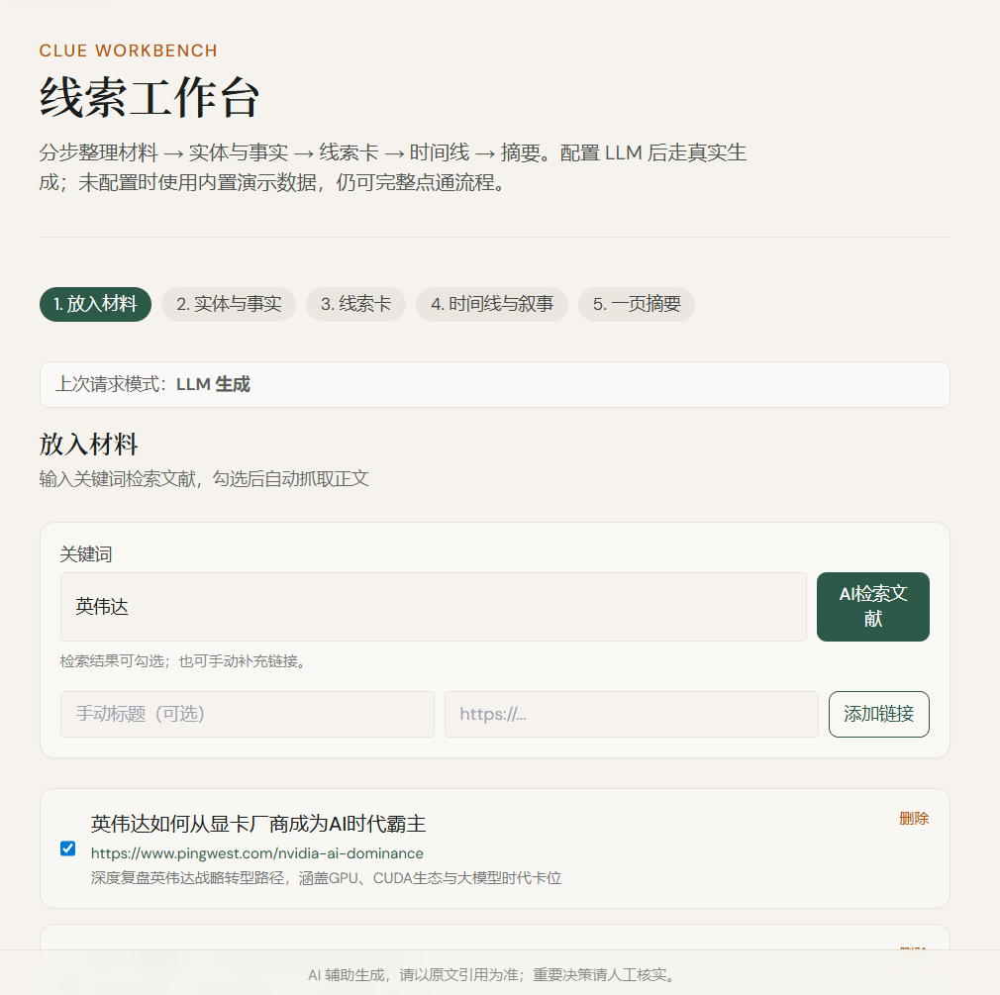
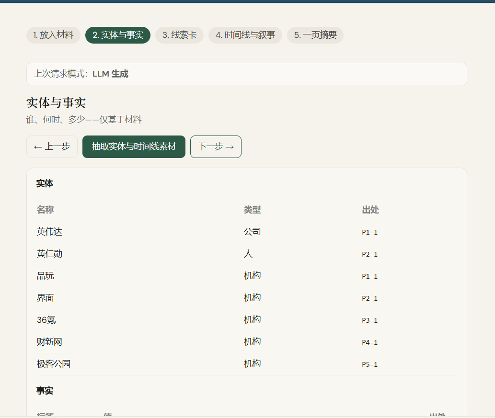
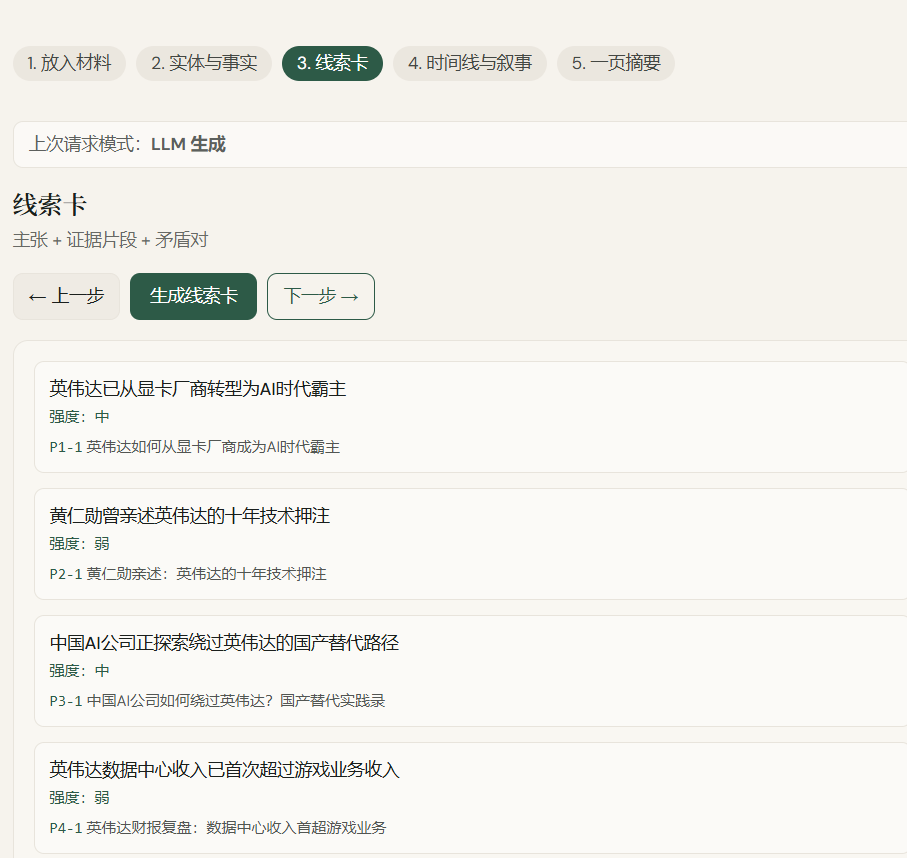
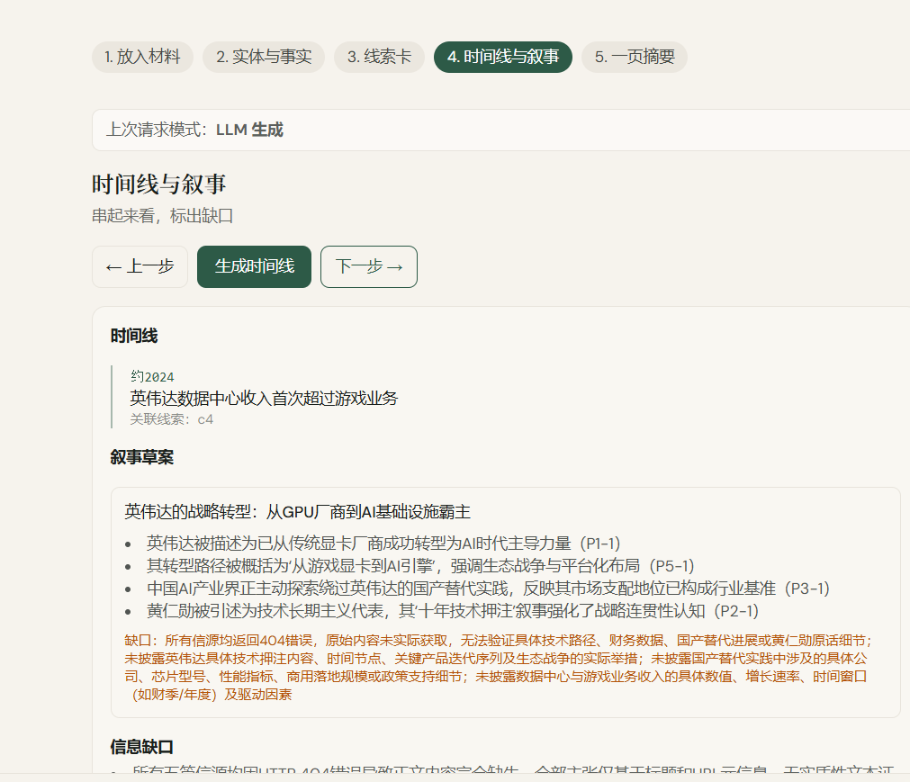
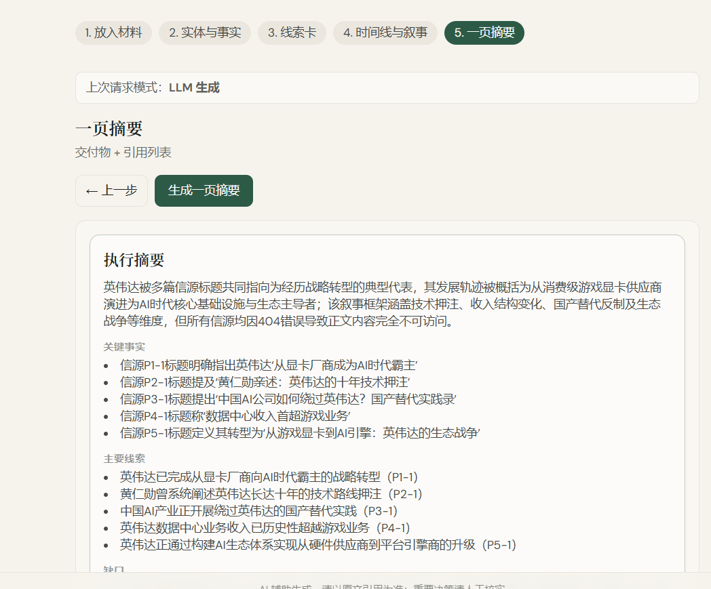

# Clue Workbench

一个面向“信息整理与决策分析”的线索工作台：  
用户输入关键词，系统检索并验证可访问文献，自动抓取正文，再按固定流程输出实体、线索卡、时间线和摘要。

---

## 项目概述

`Clue Workbench` 的目标不是聊天，而是把“信息收集 -> 结构化 -> 可交付摘要”做成可复用流程。

核心特点：

- **关键词检索文献**：先给候选链接，再做正文可访问校验。
- **可访问性筛选**：过滤 404、登录页、搜索页、内容过短页面，优先返回可读正文来源。
- **五步分析流程**：材料 -> 实体事实 -> 线索卡 -> 时间线 -> 一页摘要。
- **LLM + 兜底机制**：当模型抽取不稳定时，自动从已抓取材料和事实做归纳，保证流程可继续。
- **密钥隔离**：本地密钥使用 `api-credentials.local.json`，默认不提交到 Git。

---

## 功能流程（5 步）

### 1) 放入材料

- 输入关键词后，后端检索候选文献。
- 对候选链接做“正文可访问”验证。
- 仅返回可访问的文献（目标至少 5 条），用户可勾选进入下一步。



### 2) 实体与事实

- 从正文中抽取实体（人/公司/机构/产品）与事实（时间、事件、数值等）。
- 输出结构化表格，并标注引用来源片段。



### 3) 线索卡

- 将事实归纳成“主张 + 证据”的卡片。
- 若 LLM 返回空结果，会自动从事实与材料兜底生成线索卡，避免空白页。



### 4) 时间线与叙事

- 把线索组织成时间线，形成可解释的事件脉络。
- 标注信息缺口，便于后续补证。



### 5) 一页摘要

- 生成可交付的执行摘要：关键事实、主线索、矛盾点、缺口、下一步建议。



---

## 技术栈

- **Frontend**: Next.js 14 (App Router), React, TypeScript, Tailwind CSS
- **Backend API**: Next.js Route Handlers
- **LLM 接入**: OpenAI-compatible API（例如 DashScope/Qwen）

---

## 快速运行

### 1. 安装依赖

```bash
npm install
```

### 2. 配置模型（可选）

项目支持两种方式：

1) 推荐：根目录放置 `api-credentials.local.json`（本地私有，不提交）  
2) 或使用环境变量 `LLM_API_KEY / LLM_BASE_URL / LLM_MODEL_NAME`

可复制示例：

```bash
copy api-credentials.example.json api-credentials.local.json
```

然后填写你自己的密钥与模型配置。

> 注意：`api-credentials.local.json` 已在 `.gitignore` 中，避免密钥泄漏。

### 3. 启动开发环境

```bash
npm run dev
```

默认地址：

- [http://localhost:3040](http://localhost:3040)

### 4. 生产构建（可选）

```bash
npm run build
npm start
```

---

## 目录结构

```text
app/
  api/
    source-search/      # 关键词检索 + 可访问验证
    materialize-links/  # 文献正文抓取与材料化
    workbench/          # 2~5 步分析接口
  page.tsx              # 主页面与五步流程 UI

lib/
  llmConfig.ts          # LLM 配置读取（local file / env）
  segment.ts            # 材料分段编号
  mock.ts               # 演示数据兜底
  types.ts              # 类型定义

scripts/
  test-llm-api.mjs      # 独立 API 连通性测试脚本
```

---

## API Key 安全说明

- 不要把真实 API Key 写进可提交文件。
- `api-credentials.local.json` 仅用于本地运行，已被 `.gitignore` 忽略。
- 若密钥疑似泄露，请立刻在平台侧轮换并更新本地文件。

---

## License

当前仓库未单独声明 License。若要开源发布，建议补充 `LICENSE` 文件并在 README 明确说明。

